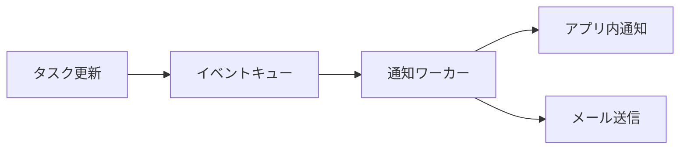

# チーム通知機能 設計書

> この文書はAIが生成した設計書のサンプルです。気になった箇所を選択すると、その場でMarkになります。
> Markをクリックすると、メモを書いたり削除したりできます。Ctrlを押しながらドラッグするとMarkにならない通常の選択になり、Ctrl+Zで直前の操作を取り消せます。

## 概要

チームメンバーのタスク状況が変わったときに、関係者へ通知を送る機能を追加する。
現状はメンバーが自分でダッシュボードを確認する必要があり、レビュー依頼の見落としが週に数件発生している。

本機能の目的は、**見落としをゼロにすること**である。通知の量が多すぎると逆に無視されるため、通知は必要最小限に絞る。

## 要件

### 機能要件

- タスクの担当者が変わったとき、新しい担当者に通知する
- レビュー依頼が届いたとき、レビュアーに通知する
- 期限の24時間前に、担当者へリマインドを送る
- 通知はアプリ内とメールの両方に送る

### 非機能要件

- 通知はイベント発生から **5秒以内** に届くこと
- 1日あたり最大10万件の通知を処理できること
- 通知設定はユーザーごとに変更できること（MVPでは全員同じ設定とする）

## 設計

### データモデル

通知は単一の `notifications` テーブルで管理する。スキーマ設計を単純にするため、初期段階では全データを単一テーブルで管理することで、マイグレーションを不要にする。

| カラム | 型 | 説明 |
| --- | --- | --- |
| id | UUID | 通知ID |
| user_id | UUID | 通知先ユーザー |
| kind | TEXT | 通知の種類（assign / review / reminder） |
| payload | JSONB | 通知内容 |
| read_at | TIMESTAMP | 既読日時。未読なら NULL |

既読になった通知は30日後に削除する。

### 処理フロー

イベントはキューを経由して通知ワーカーに渡す。



ワーカーは失敗した送信を最大3回まで再試行する。3回失敗した通知は破棄する。

### API

通知の取得は次のAPIで行う。

```ts
// 未読通知を新しい順に取得する
async function listUnread(userId: string, limit = 50): Promise<Notification[]> {
  return db.notifications.findMany({
    where: { userId, readAt: null },
    orderBy: { createdAt: 'desc' },
    take: limit,
  })
}
```

認証はMVPでは省略し、社内ネットワークからのアクセスのみを許可する。

## 実装計画

1. データモデルとマイグレーションを作成する（2日）
2. イベントキューと通知ワーカーを実装する（4日）
3. アプリ内通知のUIを実装する（3日）
4. メール送信を実装する（2日）

- [x] 既存のイベント基盤の調査
- [ ] メール送信サービスの選定
- [ ] 負荷試験の計画

MVPは2週間で完成させる。

## リスク

- メール送信サービスの上限に達すると、通知が遅延する可能性がある
- 通知が多すぎると、ユーザーが通知をオフにしてしまう可能性がある
- 詳細は[運用ガイド](https://example.com/ops)を参照すること
